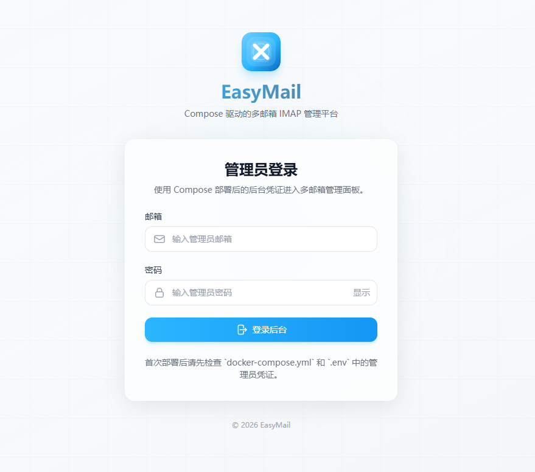
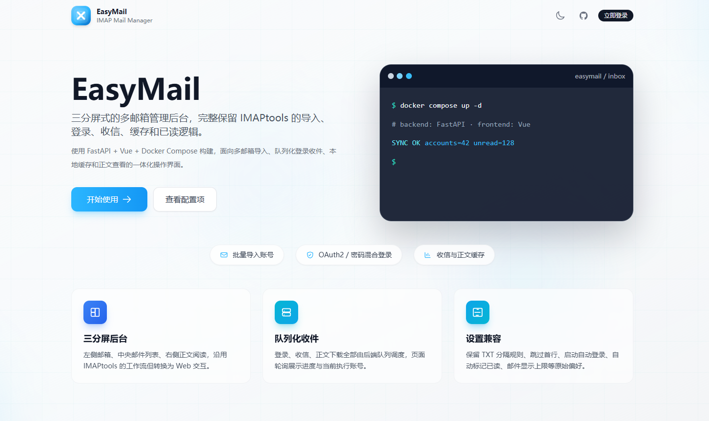
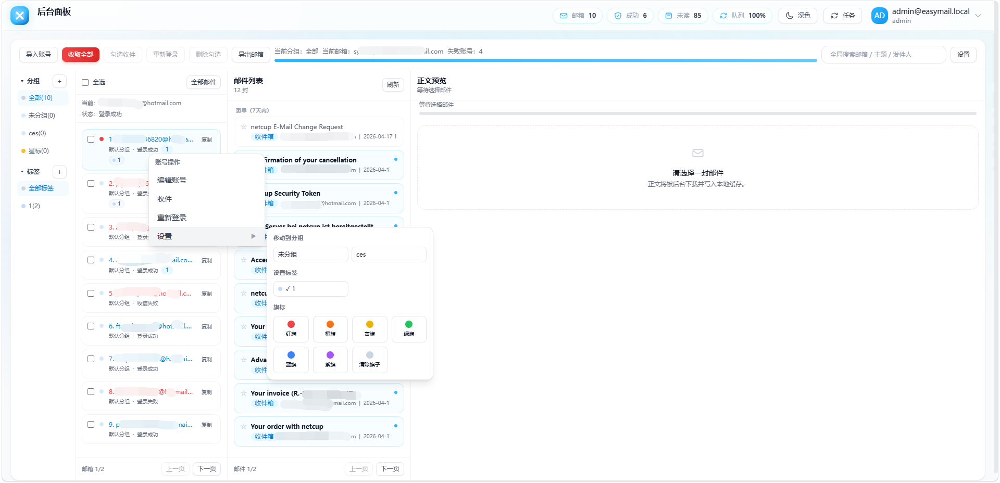

<h1 align="center">
  
  <br />
  EasyMail
</h1>

<div align="center">
  多邮箱账号的统一收件、管理与日志排查平台
</div>

## 简介

EasyMail 是一个基于 `FastAPI + Vue 3 + Docker` 的多邮箱管理工具，面向 Outlook / Hotmail / IMAP 邮箱的批量导入、登录、收件、正文查看、分组标签管理、任务调度与日志排查。

## 功能特性

- 多邮箱批量导入与统一管理
- Outlook `Graph API -> IMAP` 自动回退
- 三分屏邮件工作台
- 分组 / 标签 / 星标
- Token 全量刷新与定时刷新
- 自动收件与账号备份
- 结构化日志页面
- 单镜像 Docker 部署

## 预览

<div align="center">
<table>
  <tr>
    <td align="center"><strong>登录页</strong></td>
    <td align="center"><strong>首页</strong></td>
    <td align="center"><strong>后台</strong></td>
  </tr>
  <tr>
    <td align="center"></td>
    <td align="center"></td>
    <td align="center"></td>
  </tr>
</table>
</div>

## 快速开始

### 1. 快速开始

```bash
git clone https://github.com/vivibudong/EasyMail.git
cd EasyMail
cp .env.example .env
docker compose up -d
```

启动后访问：

- `http://127.0.0.1:3000`

首次使用请修改：

- `ADMIN_EMAIL`
- `ADMIN_PASSWORD`
- `JWT_SECRET`

### 2. 本地开发

```bash
git clone https://github.com/vivibudong/EasyMail.git
cd EasyMail
cp .env.example .env
docker build -t easymail:local .
docker run -d \
  --name easymail-local \
  -p 3000:8000 \
  --env-file .env \
  -v $(pwd)/data:/app/data \
  easymail:local
```

## 项目结构

```text
backend/   FastAPI 后端
frontend/  Vue 前端
data/      运行时数据目录
img/       演示图
```
